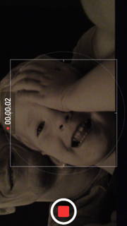
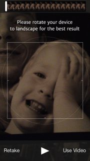
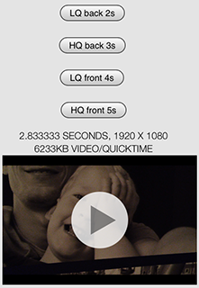

# VideoCapturePlus PhoneGap plugin

by [Eddy Verbruggen](http://www.x-services.nl/blog)

## 0. Index

1. [Description](https://github.com/EddyVerbruggen/VideoCapturePlus-PhoneGap-Plugin#1-description)
2. [Screenshots](https://github.com/EddyVerbruggen/VideoCapturePlus-PhoneGap-Plugin#2-screenshots)
3. [Installation](https://github.com/EddyVerbruggen/VideoCapturePlus-PhoneGap-Plugin#3-installation)
	3. [Automatically (CLI / Plugman)](https://github.com/EddyVerbruggen/VideoCapturePlus-PhoneGap-Plugin#automatically-cli--plugman)
	3. [Manually](https://github.com/EddyVerbruggen/VideoCapturePlus-PhoneGap-Plugin#manually)
	3. [PhoneGap Build](https://github.com/EddyVerbruggen/VideoCapturePlus-PhoneGap-Plugin#phonegap-build)
4. [Usage](https://github.com/EddyVerbruggen/VideoCapturePlus-PhoneGap-Plugin#4-usage)
5. [Credits](https://github.com/EddyVerbruggen/VideoCapturePlus-PhoneGap-Plugin#5-credits)
6. [License](https://github.com/EddyVerbruggen/VideoCapturePlus-PhoneGap-Plugin#6-license)

## 1. Description

* This plugin offers some useful extras on top of the [default PhoneGap Video Capture capabilities](http://docs.phonegap.com/en/3.3.0/cordova_media_capture_capture.md.html#capture.captureVideo):
  * HD recording.
  * Starting with the front camera.
  * A custom overlay (currently iOS only).
* For PhoneGap 3.0.0 and up.
* Works on the same Android and iOS versions as the [original plugin](http://docs.phonegap.com/en/3.3.0/cordova_media_capture_capture.md.html#capture.captureVideo).
* Compatible with [Cordova Plugman](https://github.com/apache/cordova-plugman).
* Pending official support at [PhoneGap Build](https://build.phonegap.com/plugins).

## 2. Screenshots

Before recording, portrait mode (the 'Please rotate' text is part of the [overlay png file](demo/img/cameraoverlays/overlay-iPhone-portrait.png)):


During recording, landscape mode:



Reviewing the recording, portrait mode:



After recording you can extract the metadata, [see the demo folder for the code of this example](demo):


## 3. Installation


IMPORTANT NOTE: if you currently use the org.apache.cordova.media-capture plugin, remove it (otherwise your build will fail, or at least on PhoneGap Build it does).


### Automatically (CLI / Plugman)
VideoCapturePlus is compatible with [Cordova Plugman](https://github.com/apache/cordova-plugman), compatible with [PhoneGap 3.0 CLI](http://docs.phonegap.com/en/3.0.0/guide_cli_index.md.html#The%20Command-line%20Interface_add_features), here's how it works with the CLI:

```
$ phonegap local plugin add https://github.com/EddyVerbruggen/VideoCapturePlus-PhoneGap-Plugin.git
```
or
```
$ cordova plugin add https://github.com/EddyVerbruggen/VideoCapturePlus-PhoneGap-Plugin.git
```
run this command afterwards:
```
$ cordova prepare
```

VideoCapturePlus.js is brought in automatically. There is no need to change or add anything in your html.

### Manually

1\. Add the following xml to your `config.xml` in the root directory of your `www` folder:
```xml
<!-- for iOS -->
<feature name="VideoCapturePlus">
  <param name="ios-package" value="VideoCapturePlus" />
</feature>
```
```xml
<!-- for Android -->
<feature name="VideoCapturePlus">
  <param name="android-package" value="nl.xservices.plugins.videocaptureplus.VideoCapturePlus" />
</feature>
```

For Android, add these to your `AndroidManifest.xml`:
```xml
<uses-permission android:name="android.permission.RECORD_VIDEO"/>
<uses-permission android:name="android.permission.WRITE_EXTERNAL_STORAGE"/>
```

For iOS, you'll need to add the `CoreGraphics.framework` and `MobileCoreServices.framework` to your project.

2\. Grab a copy of VideoCapturePlus.js, add it to your project and reference it in `index.html`:
```html
<script type="text/javascript" src="js/VideoCapturePlus.js"></script>
```

3\. Download the source files for iOS and/or Android and copy them to your project.

iOS: Copy `VideoCapturePlus.h` and `VideoCapturePlus.m` to `platforms/ios/<ProjectName>/Plugins`

Android: Copy `VideoCapturePlus.java` and `FileHelper.java` to `platforms/android/src/nl/xservices/plugins/videocaptureplus` (create the folders).

### PhoneGap Build

VideoCapturePlus is pending approval at [PhoneGap Build](http://build.phonegap.com/plugins). Once it's approved, just add the following xml to your `config.xml` to always use the latest version of this plugin:
```xml
<gap:plugin name="nl.x-services.plugins.videocaptureplus" />
```
or to use this exact version:
```xml
<gap:plugin name="nl.x-services.plugins.videocaptureplus" version="1.0" />
```

VideoCapturePlus.js is brought in automatically. There is no need to change or add anything in your html.

## 4. Usage
See the [demo project](demo) for all details, but the most interesting part is this:
```javascript
  window.plugins.videocaptureplus.captureVideo(
      captureSuccess, // your success callback
      captureError,   // your error callback
      {
        limit: 1, // the nr of videos to record, default 1 (on iOS always 1)
        duration: duration, // max duration in seconds, default 0, which is 'forever'
        highquality: highquality, // set to true to override the default low quality setting
        frontcamera: frontcamera, // set to true to override the default backfacing camera setting
        // you'll want to sniff the useragent/device and pass the best overlay based on that.. assuming iphone here
        portraitOverlay: 'www/img/cameraoverlays/overlay-iPhone-portrait.png', // put the png in your www folder
        landscapeOverlay: 'www/img/cameraoverlays/overlay-iPhone-landscape.png' // not passing an overlay means no image is shown for the landscape orientation
      }
  );
```

## 5. CREDITS ##

Cordova, for [the original plugin repository](https://github.com/apache/cordova-plugin-media-capture), which is the basis for this one.

## 6. License

[The MIT License (MIT)](http://www.opensource.org/licenses/mit-license.html)

Permission is hereby granted, free of charge, to any person obtaining a copy
of this software and associated documentation files (the "Software"), to deal
in the Software without restriction, including without limitation the rights
to use, copy, modify, merge, publish, distribute, sublicense, and/or sell
copies of the Software, and to permit persons to whom the Software is
furnished to do so, subject to the following conditions:

The above copyright notice and this permission notice shall be included in
all copies or substantial portions of the Software.

THE SOFTWARE IS PROVIDED "AS IS", WITHOUT WARRANTY OF ANY KIND, EXPRESS OR
IMPLIED, INCLUDING BUT NOT LIMITED TO THE WARRANTIES OF MERCHANTABILITY,
FITNESS FOR A PARTICULAR PURPOSE AND NONINFRINGEMENT. IN NO EVENT SHALL THE
AUTHORS OR COPYRIGHT HOLDERS BE LIABLE FOR ANY CLAIM, DAMAGES OR OTHER
LIABILITY, WHETHER IN AN ACTION OF CONTRACT, TORT OR OTHERWISE, ARISING FROM,
OUT OF OR IN CONNECTION WITH THE SOFTWARE OR THE USE OR OTHER DEALINGS IN
THE SOFTWARE.


[](https://bitdeli.com/free "Bitdeli Badge")
